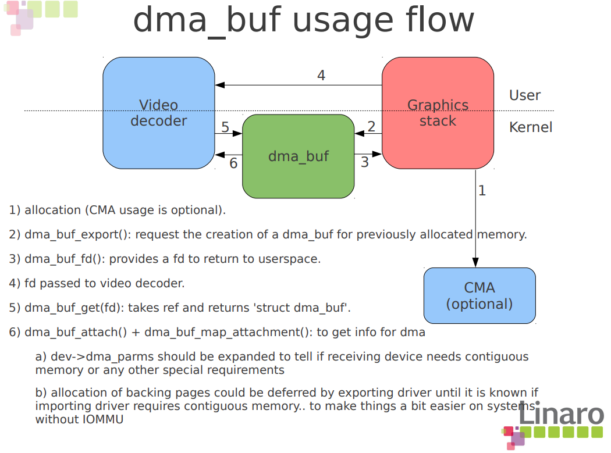

## dma-buf
dma_buf_attach 计数器+1（callback attach()），指出importdevice
device指针可以指出device_dma_parameters，代表dma支持情况

dma_buf_map_attachment 做dma映射

## dma-fence
fence包括dmafence，就是softfence。还有hardware fence，这个fence和dmafence有对应关系。driver初始化阶段会在pcie地址空间分一段fencebuffer供GPU同步fence。driver下ringbuffer的时候，指定的dmafence关联的hardware fence就会插到ringbuffer的后面，当task完成后ringbuffer的fence就会flush到fencebuffer，此时driver就可以做fence signal和fence callback。
